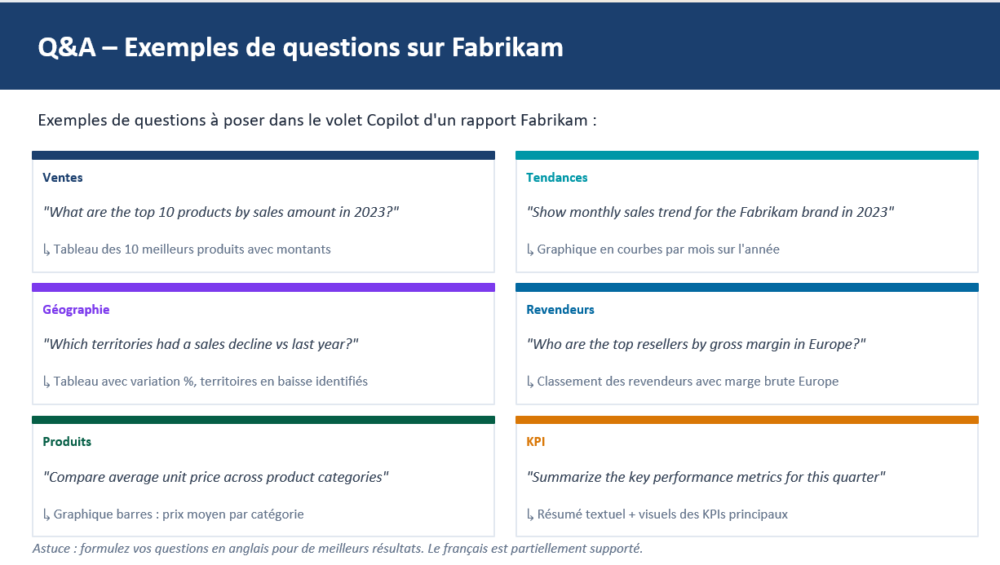

# 1.1. Poser des exemples de questions sur Fabrikam (Q&A Copilot)

Ce guide détaille comment utiliser le volet **Copilot** d'un rapport Power BI pour poser des questions en langage naturel sur les données Fabrikam et obtenir automatiquement tableaux, graphiques et résumés.

## Prérequis

- Le fichier **Fabrikam Company Sales Report.pbix** a été importé dans le Workspace **Dubreuil** (voir [0.1. Récupération du fichier Fabrikam.md](0.1.%20R%C3%A9cup%C3%A9ration%20du%20fichier%20Fabrikam.md)).
- Copilot pour Power BI est activé pour le tenant/capacité.

## Support



## Étapes

### 1. Ouvrir le rapport Fabrikam

1. Dans le Workspace Dubreuil, cliquer sur le rapport **Fabrikam Company Sales Report** pour l'ouvrir.
2. Passer en mode **Édition** si le rapport s'ouvre en mode lecture.

> 📷 **Capture d'écran à insérer ici** : ouverture du rapport Fabrikam en mode édition.

### 2. Ouvrir le volet Copilot

1. Dans le ruban **Accueil**, cliquer sur le bouton **Copilot**.
2. Le volet Copilot s'ouvre sur la droite du rapport, avec une zone de saisie de question en bas.

> 📷 **Capture d'écran à insérer ici** : volet Copilot ouvert avec la zone de saisie visible.

### 3. Poser une première question sur les ventes

1. Dans la zone de saisie, taper (ou copier/coller) :

   ```text
   What are the top 10 products by sales amount in 2023?
   ```

2. Valider avec **Entrée**.
3. Observer le résultat : Copilot doit renvoyer un **tableau des 10 meilleurs produits avec leurs montants**.

> 📷 **Capture d'écran à insérer ici** : réponse de Copilot avec le tableau des top 10 produits.

### 4. Poser une question sur les tendances

1. Taper :

   ```text
   Show monthly sales trend for the Fabrikam brand in 2023
   ```

2. Vérifier que Copilot génère un **graphique en courbes par mois sur l'année**.

> 📷 **Capture d'écran à insérer ici** : graphique de tendance mensuelle généré par Copilot.

### 5. Poser une question sur la géographie

1. Taper :

   ```text
   Which territories had a sales decline vs last year?
   ```

2. Vérifier que Copilot renvoie un **tableau avec la variation en %** et identifie les territoires en baisse.

> 📷 **Capture d'écran à insérer ici** : tableau des territoires avec variation de ventes.

### 6. Poser une question sur les revendeurs

1. Taper :

   ```text
   Who are the top resellers by gross margin in Europe?
   ```

2. Vérifier le **classement des revendeurs avec leur marge brute en Europe**.

> 📷 **Capture d'écran à insérer ici** : classement des revendeurs par marge brute.

### 7. Poser une question sur les produits

1. Taper :

   ```text
   Compare average unit price across product categories
   ```

2. Vérifier l'apparition d'un **graphique en barres du prix moyen par catégorie**.

> 📷 **Capture d'écran à insérer ici** : graphique en barres du prix moyen par catégorie.

### 8. Poser une question sur les KPI

1. Taper :

   ```text
   Summarize the key performance metrics for this quarter
   ```

2. Vérifier que Copilot renvoie un **résumé textuel accompagné de visuels des principaux KPIs**.

> 📷 **Capture d'écran à insérer ici** : résumé textuel + visuels de KPIs générés par Copilot.

### 9. Comparer avec une question en français (optionnel)

1. Reformuler une des questions précédentes en français, par exemple : *"Quels sont les 10 meilleurs produits par montant des ventes en 2023 ?"*.
2. Comparer la qualité et la précision de la réponse avec la version anglaise.

> **Astuce (slide 21) :** formulez vos questions en anglais pour de meilleurs résultats. Le français est partiellement supporté.

> 📷 **Capture d'écran à insérer ici** : comparaison réponse anglaise vs réponse française pour la même question.

## Résultat attendu

- Les stagiaires savent formuler des questions Copilot dans les 6 grandes catégories (ventes, tendances, géographie, revendeurs, produits, KPI) et interpréter les visuels générés automatiquement.

➡️ Étape suivante : [1.2. Générer une smart narrative.md](1.2.%20G%C3%A9n%C3%A9rer%20une%20smart%20narrative.md)
