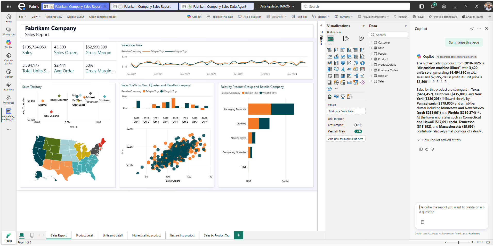
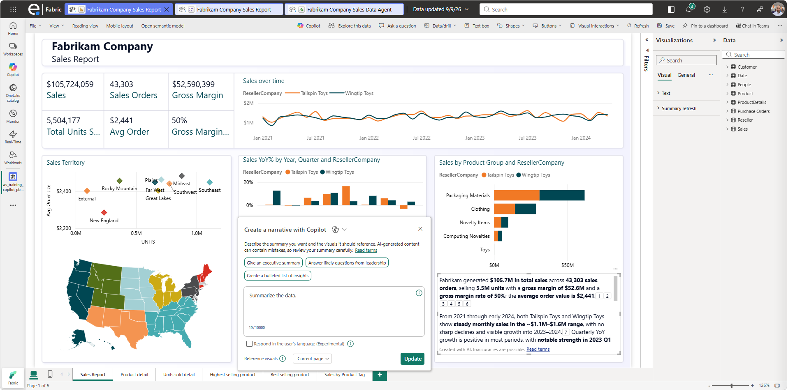
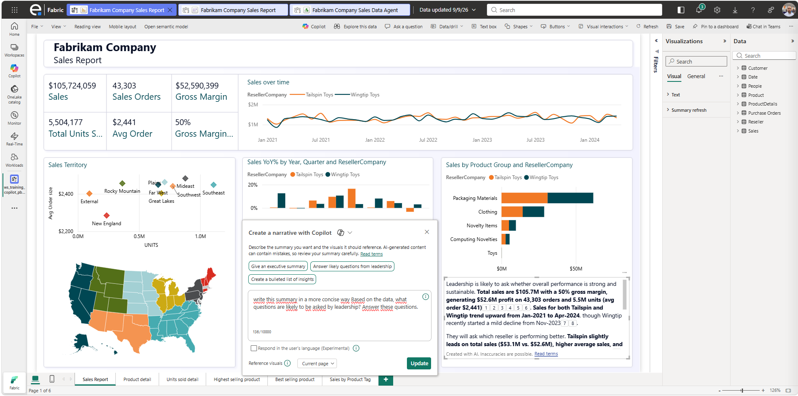

# 1.2. Générer une smart narrative

Ce guide explique comment demander à **Copilot** de générer une **smart narrative** (résumé textuel dynamique) à partir d'une page du rapport Fabrikam.

## Prérequis

- Le rapport **Fabrikam Company Sales Report** est ouvert en mode édition dans le Workspace [FORMATION].
- Vous avez déjà testé quelques questions Copilot (voir [1.1. Poser des exemples de questions sur Fabrikam.md](1.1.%20Poser%20des%20exemples%20de%20questions%20sur%20Fabrikam.md)).

## Qu'est-ce qu'une smart narrative ?

Une **smart narrative** est un visuel Power BI qui affiche automatiquement, en langage naturel, les principaux enseignements d'une page de rapport (valeurs clés, tendances, écarts significatifs...). Copilot permet de la générer et de la reformuler sans écrire de formule.

## Étapes

### 1. Se positionner sur la page à résumer

1. Ouvrir la page du rapport contenant les visuels de ventes (ex. page d'accueil ou page "Sales Overview").
2. Vérifier que les visuels de la page sont chargés et affichent des données.

### 2. Ouvrir le volet Copilot

1. Cliquer sur le bouton **Copilot** dans le ruban **Accueil** (s'il n'est pas déjà ouvert).

### 3. Demander un résumé de la page

1. Dans la zone de saisie du volet Copilot, taper :

   ```text
   Summarize this page
   ```

   ou, en français :

   ```text
   Résume cette page
   ```

2. Valider avec **Entrée**.
3. Copilot génère un texte de synthèse mettant en avant les chiffres clés et tendances de la page.

> 

### 4. Créer un visuel "Smart narrative"

1. Faire glisser le visuel **Smart narrative** vers un emplacement approprié de la page (ex. en haut, sous le titre).
2. Ajuster sa taille pour qu'il ne recouvre pas les autres visuels.

> 

### 5. Personnaliser ou régénérer le texte si besoin

1. Sélectionner le visuel Smart narrative.
2. Utiliser à nouveau Copilot pour demander une reformulation, par exemple :

   ```text
   Answer likely questions from leadership
   ```

3. Vérifier que le texte se met à jour dans le visuel.

> 

### 7. Vérifier la mise à jour dynamique

1. Appliquer un filtre sur la page (ex. filtrer sur une année ou une région via un slicer existant).
2. Vérifier que le texte de la smart narrative se met à jour automatiquement en fonction du contexte de filtre.

## Résultat attendu

- Une smart narrative est intégrée à la page de rapport Fabrikam, résume les données affichées et se met à jour dynamiquement selon les filtres appliqués.

➡️ Étape suivante : [1.3. Créer un rapport de zéro avec Copilot.md](1.3.%20Cr%C3%A9er%20un%20rapport%20de%20z%C3%A9ro%20avec%20Copilot.md)
