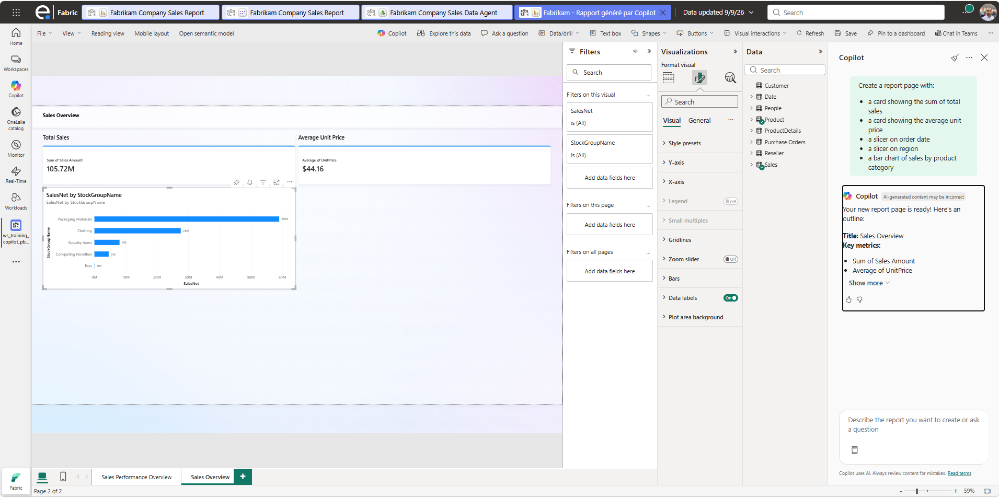

# 1.4. Créer une page de rapport (slide 79)

Ce guide détaille comment demander à **Copilot** de créer une **page de rapport complète**, en combinant les trois types de visuels (cartes, slicers, visuels graphiques), sur le modèle sémantique Fabrikam.

## Prérequis

- Un rapport Fabrikam (existant ou créé à l'étape [1.3](1.3.%20Cr%C3%A9er%20un%20rapport%20de%20z%C3%A9ro%20avec%20Copilot.md)) est ouvert en mode édition.

## Support

- **J'utilise les trois types de visuels** : `card`, `slicer` et `visual`.
- **Je précise pour chaque visuel** les **champs**, les **agrégations** (somme, moyenne, max, min, distinct count)...
- **... et les découpages** (par date, produit, région, etc.).

## Étapes

### 1. Ajouter une nouvelle page vierge

1. Dans le rapport ouvert, cliquer sur le bouton **+** en bas de l'écran pour ajouter une nouvelle page.
2. Renommer la page, par exemple `Page Copilot`.

### 2. Ouvrir le volet Copilot sur cette page

1. Cliquer sur **Copilot** dans le ruban **Accueil**.
2. Vérifier que le volet Copilot est bien actif sur la nouvelle page.

> 📷 **Capture d'écran à insérer ici** : volet Copilot ouvert sur la nouvelle page.

### 3. Rédiger un prompt en précisant les 3 types de visuels

1. Construire un prompt qui mentionne explicitement des **cards**, un **slicer** et des **visuals**, avec les champs, agrégations et découpages souhaités. Exemple :

   ```text
   Create a report page with:
   - a card showing the sum of total sales
   - a card showing the average unit price
   - a slicer on order date
   - a slicer on region
   - a bar chart of sales by product category
   ```

2. Valider avec **Entrée**.

> 📷 **Capture d'écran à insérer ici** : prompt détaillé saisi dans le volet Copilot.

### 4. Observer la génération des visuels par Copilot

1. Vérifier que Copilot a bien créé :
   - Les **cartes** (`card`) avec les bonnes agrégations (somme, moyenne...).
   - Les **slicers** pour le découpage par date et par région.
   - Le **visuel graphique** (`visual`) demandé (ex. graphique en barres).

### 5. Vérifier les champs et agrégations de chaque carte

1. Cliquer sur chaque carte pour ouvrir le volet **Visualisations**.
2. Vérifier le champ utilisé et l'agrégation appliquée (ex. `Sum of Total Sales`, `Average of Unit Price`).
3. Corriger manuellement si l'agrégation ne correspond pas à l'attente (ex. remplacer Somme par Moyenne).

### 6. Vérifier les découpages (slicers)

1. Cliquer sur le slicer de date : vérifier qu'il permet de filtrer par période.
2. Cliquer sur le slicer de région : vérifier la liste des régions proposées.
3. Tester un filtre pour confirmer que les cartes et le visuel se mettent à jour.

### 7. Compléter la page si nécessaire

1. Si un élément manque (ex. un slicer supplémentaire par produit), redemander à Copilot :

   ```text
   Add a slicer on product category to this page
   ```

2. Vérifier l'ajout correct du nouveau slicer.

> 

### 8. Mettre en forme la page finale

1. Harmoniser l'alignement et la taille des cartes, slicers et visuel.
2. Ajouter un titre de page clair (ex. "Vue commerciale Fabrikam").

## Résultat attendu

- Une page de rapport complète a été créée avec Copilot, combinant cartes, slicers et visuels, en précisant explicitement champs, agrégations et découpages.

➡️ Étape suivante : [1.5. Créer un visuel à la volée.md](1.5.%20Cr%C3%A9er%20un%20visuel%20%C3%A0%20la%20vol%C3%A9e.md)
