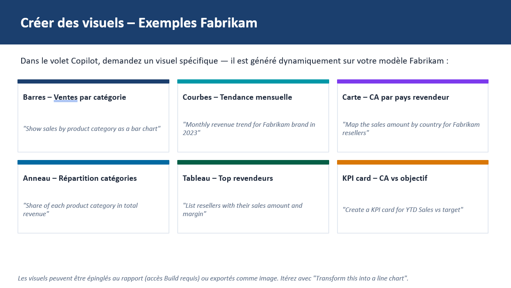
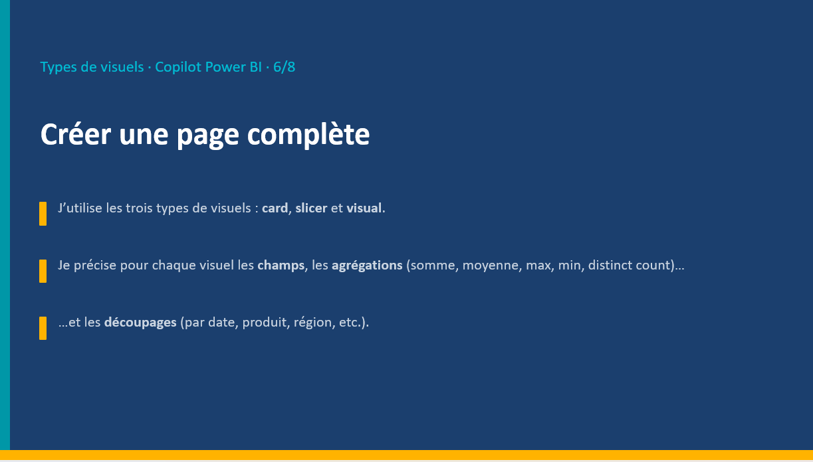

# 1.5. Créer un visuel à la volée (slides 53 & 80)

Ce guide explique comment demander à **Copilot** de générer, un par un, différents types de visuels sur le modèle Fabrikam, puis comment les épingler au rapport ou les exporter.

## Prérequis

- Un rapport Fabrikam est ouvert en mode édition (idéalement la page créée à l'étape [1.4](1.4.%20Cr%C3%A9er%20une%20page%20de%20rapport.md)).

## Support





Dans le volet Copilot, on peut demander un visuel spécifique — il est généré dynamiquement sur le modèle Fabrikam :

| Visuel | Prompt exemple |
|---|---|
| Barres – Ventes par catégorie | *"Show sales by product category as a bar chart"* |
| Courbes – Tendance mensuelle | *"Monthly revenue trend for Fabrikam brand in 2023"* |
| Carte – CA par pays revendeur | *"Map the sales amount by country for Fabrikam resellers"* |
| Anneau – Répartition catégories | *"Share of each product category in total revenue"* |
| Tableau – Top revendeurs | *"List resellers with their sales amount and margin"* |
| KPI card – CA vs objectif | *"Create a KPI card for YTD Sales vs target"* |

> **Astuce (slide 53) :** les visuels peuvent être épinglés au rapport (accès *Build* requis) ou exportés comme image. Itérez avec des prompts comme *"Transform this into a line chart"*.

## Étapes

### 1. Ouvrir le volet Copilot sur une page vierge (ou dédiée aux tests)

1. Ajouter une nouvelle page ou utiliser une page de test.
2. Ouvrir le volet **Copilot** depuis le ruban **Accueil**.

> 📷 **Capture d'écran à insérer ici** : page de test avec le volet Copilot ouvert.

### 2. Générer un visuel en barres

1. Taper le prompt :

   ```text
   Show sales by product category as a bar chart
   ```

2. Vérifier l'apparition d'un graphique en barres des ventes par catégorie.

> 📷 **Capture d'écran à insérer ici** : graphique en barres généré.

### 3. Générer un visuel en courbes

1. Taper :

   ```text
   Monthly revenue trend for Fabrikam brand in 2023
   ```

2. Vérifier le graphique en courbes de la tendance mensuelle.

> 📷 **Capture d'écran à insérer ici** : graphique en courbes généré.

### 4. Générer une carte géographique

1. Taper :

   ```text
   Map the sales amount by country for Fabrikam resellers
   ```

2. Vérifier l'apparition d'une carte avec le chiffre d'affaires par pays revendeur.

> 📷 **Capture d'écran à insérer ici** : visuel carte généré.

### 5. Générer un visuel en anneau (donut)

1. Taper :

   ```text
   Share of each product category in total revenue
   ```

2. Vérifier l'apparition d'un graphique en anneau représentant la répartition par catégorie.

> 📷 **Capture d'écran à insérer ici** : visuel en anneau généré.

### 6. Générer un tableau des revendeurs

1. Taper :

   ```text
   List resellers with their sales amount and margin
   ```

2. Vérifier l'apparition d'un tableau listant les revendeurs, leur montant de ventes et leur marge.

> 📷 **Capture d'écran à insérer ici** : tableau des revendeurs généré.

### 7. Générer une carte KPI

1. Taper :

   ```text
   Create a KPI card for YTD Sales vs target
   ```

2. Vérifier l'apparition d'une carte KPI comparant les ventes cumulées de l'année à l'objectif.

> 📷 **Capture d'écran à insérer ici** : carte KPI générée.

### 8. Itérer sur un visuel existant

1. Sélectionner un des visuels précédemment générés.
2. Demander une transformation, par exemple :

   ```text
   Transform this into a line chart
   ```

3. Vérifier que le visuel change de type tout en conservant les mêmes données.

> 📷 **Capture d'écran à insérer ici** : visuel transformé après itération du prompt.

### 9. Épingler un visuel au rapport

1. Sélectionner un visuel généré par Copilot dans le volet de discussion.
2. Cliquer sur **Épingler au rapport** (ou **Ajouter au rapport**).
3. Vérifier que le visuel est bien ajouté sur le canevas de la page.

> **Remarque :** l'épinglage nécessite l'accès **Build** sur le modèle sémantique. Sans cet accès, seule l'option d'export en image est disponible.

> 📷 **Capture d'écran à insérer ici** : action d'épinglage du visuel au rapport.

### 10. Exporter un visuel en image (alternative)

1. Si l'épinglage n'est pas possible (droits insuffisants), utiliser l'option **Exporter comme image** proposée par Copilot.
2. Enregistrer l'image générée sur le poste local.

> 📷 **Capture d'écran à insérer ici** : export d'un visuel Copilot en image.

## Résultat attendu

- Les stagiaires savent générer à la volée différents types de visuels (barres, courbes, carte, anneau, tableau, KPI card) via Copilot, itérer sur leur type, puis les épingler au rapport ou les exporter.

---

Fin du lab **Copilot pour Power BI**.
