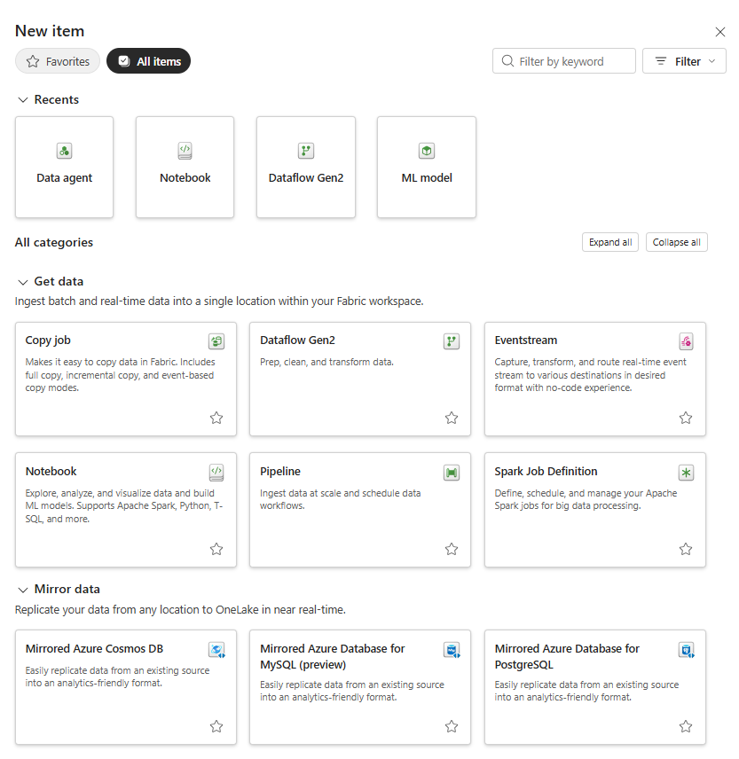
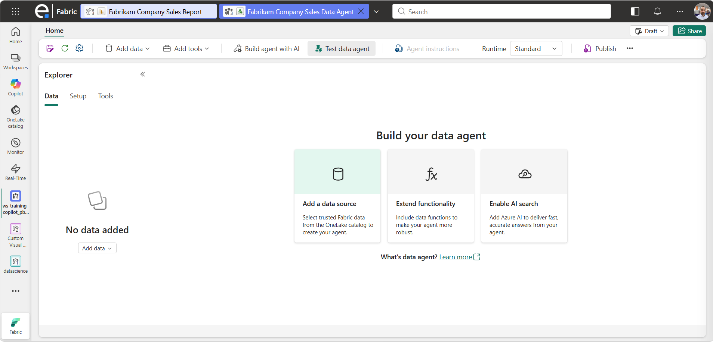
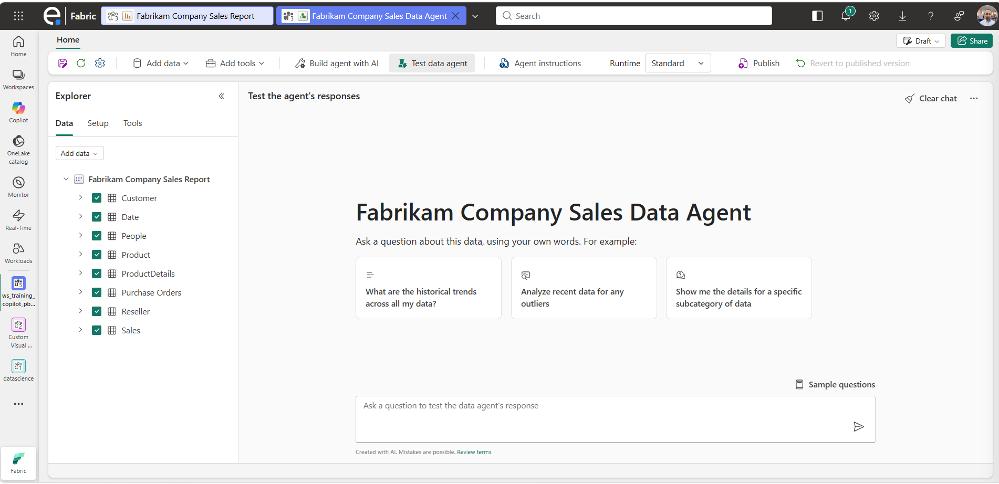
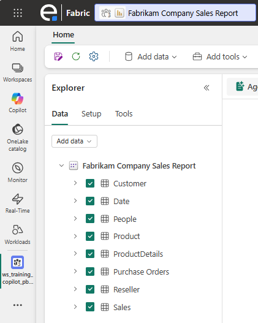
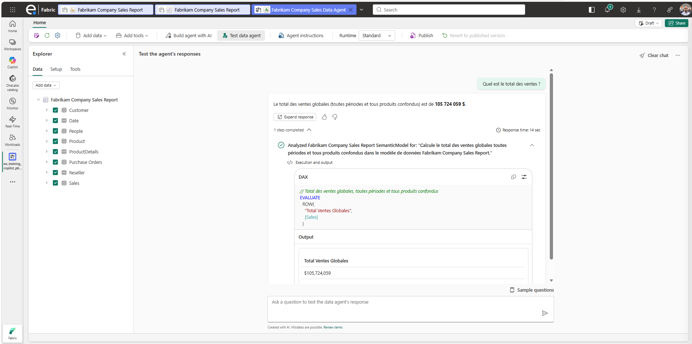
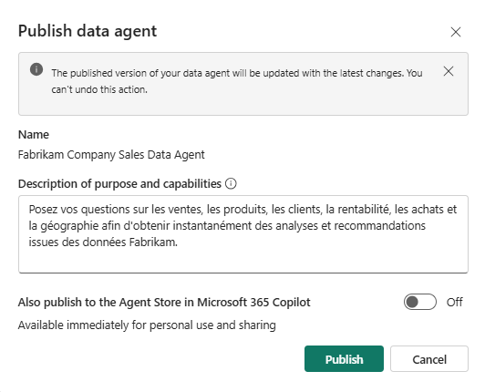

# 2.1. Créer un Data Agent sur un modèle sémantique

Ce guide détaille, pas à pas, la création d'un **Data Agent** Microsoft Fabric à partir du modèle sémantique **Fabrikam** importé précédemment dans le Workspace **[FORMATION]**.

## Prérequis

- Le fichier **Fabrikam Company Sales Report.pbix** a bien été importé dans le Workspace [FORMATION] (voir [0.1. Récupération du fichier Fabrikam.md](0.1.%20R%C3%A9cup%C3%A9ration%20du%20fichier%20Fabrikam.md)).
- Vous disposez des droits de **Contributeur** (ou supérieur) sur le workspace.
- La capacité Fabric associée au workspace est active (F2 minimum).

## Étapes

### 1. Ouvrir le Workspace [FORMATION]

1. Se connecter à [Microsoft Fabric](https://app.fabric.microsoft.com).
2. Dans le volet de gauche, cliquer sur **Workspaces** puis sélectionner **[FORMATION]**.
3. Vérifier que le rapport **Fabrikam Company Sales Report** et son modèle sémantique associé apparaissent bien dans la liste des éléments.

### 2. Créer un nouvel élément "Data Agent"

1. Dans le workspace, cliquer sur le bouton **+ Nouvel élément** (en haut de la page).
2. Dans le panneau qui s'ouvre, taper **"Data agent"** dans la barre de recherche.
3. Cliquer sur la vignette **Data agent**.

> 

### 3. Nommer le Data Agent

1. Dans la boîte de dialogue de création, saisir un nom explicite, par exemple : `Fabrikam Data Agent`.
2. Cliquer sur **Créer**.
3. L'éditeur du Data Agent s'ouvre automatiquement sur un canevas vide.

> 

### 4. Ajouter le modèle sémantique comme source de données

1. Dans l'éditeur du Data Agent, cliquer sur **+ Ajouter une source de données** (ou l'icône **+** dans le volet **Sources de données** à gauche).
2. Choisir **Modèle sémantique Power BI** comme type de source.
3. Sélectionner le workspace **[FORMATION]**, puis le modèle sémantique **Fabrikam Company Sales Report**.
4. Valider la sélection.

> 

### 5. Sélectionner les tables à exposer au Data Agent

1. Une fois la source ajoutée, la liste des tables du modèle sémantique s'affiche dans le volet de gauche.
2. Cocher les tables pertinentes pour les questions métier (ex. : `Sales`, `Product`, `Customer`, `Date`, `Region`...).
3. Décocher éventuellement les tables techniques ou non nécessaires pour limiter le périmètre de réponse du Data Agent.

>  

### 6. Tester une première question dans le volet de test

1. À droite de l'éditeur, ouvrir le volet **Tester votre Data Agent** (chat).
2. Poser une question simple, par exemple : *"Quel est le total des ventes ?"*.
3. Vérifier que le Data Agent renvoie une réponse cohérente avec une valeur chiffrée.

> 

### 7. Publier le Data Agent

1. Cliquer sur le bouton **Publier** (en haut à droite de l'éditeur).
2. Ajouter une courte description : *"Posez vos questions sur les ventes, les produits, les clients, la rentabilité, les achats et la géographie afin d'obtenir instantanément des analyses et recommandations issues des données Fabrikam."*.
3. Confirmer la publication dans la boîte de dialogue.
4. Le Data Agent est maintenant disponible pour les utilisateurs autorisés du workspace.

> 

## Résultat attendu

- Un Data Agent nommé **Fabrikam Data Agent** est créé et publié dans le Workspace [FORMATION].
- Il est connecté au modèle sémantique Fabrikam et répond correctement à une question simple sur le total des ventes.

➡️ Étape suivante : [2.2. Écrire des instructions pour modifier le ton et la longueur des réponses.md](2.2.%20%C3%89crire%20des%20instructions%20pour%20modifier%20le%20ton%20et%20la%20longueur%20des%20r%C3%A9ponses.md)
