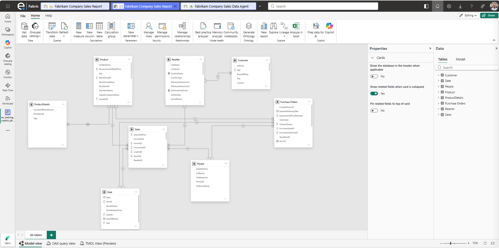
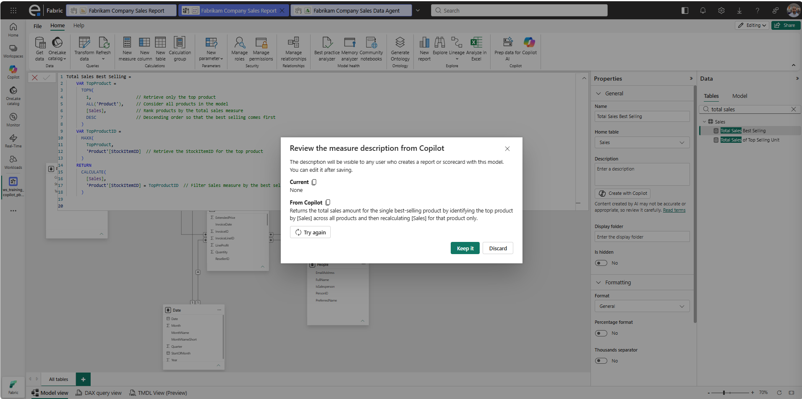
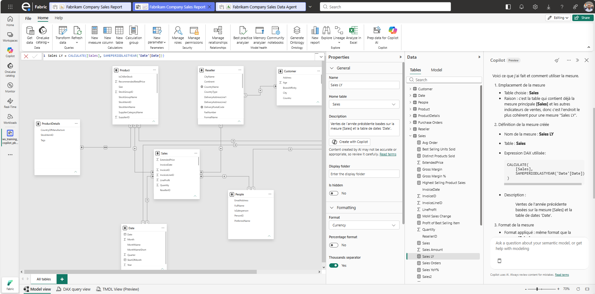
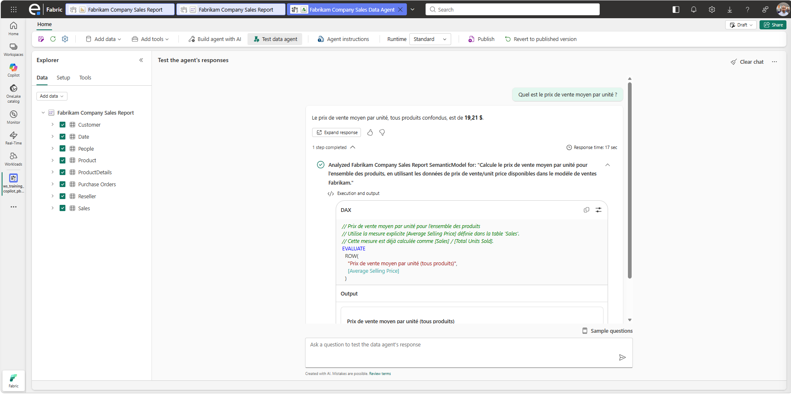

# 2.3. Ajouter des descriptions de mesures avec Copilot, dans le modèle sémantique

Ce guide explique comment utiliser **Copilot** pour générer automatiquement des descriptions de mesures dans le modèle sémantique Fabrikam, afin d'améliorer la compréhension du contexte métier par le Data Agent.

## Prérequis

- Le modèle sémantique **Fabrikam Company Sales Report** est disponible dans le Workspace [FORMATION].
- Vous disposez des droits d'édition sur le modèle sémantique.
- Copilot pour Power BI est activé pour le tenant/capacité.

## Pourquoi cette étape est importante

Le Data Agent s'appuie sur les métadonnées du modèle sémantique (noms de tables, de colonnes, de mesures, et **leurs descriptions**) pour comprendre le sens métier des données. Une mesure sans description (ex. `Total Sales`) est moins bien interprétée qu'une mesure documentée expliquant precisément son calcul et son usage.

## Étapes

### 1. Ouvrir la vue de modélisation du modèle sémantique

1. Dans le Workspace [FORMATION], cliquer sur les **"..."** à côté du modèle sémantique **Fabrikam Company Sales Report**.
2. Sélectionner **Ouvrir la vue de données** (ou **Modifier** selon l'interface), afin d'accéder à l'éditeur de modèle sémantique en ligne.

> 

### 2. Sélectionner une mesure sans description

1. Développer la table de mesures et cliquer sur une mesure, par exemple `Total Sales Best Selling`.
2. Dans le volet **Propriétés** (à droite), repérer le champ **Description**, actuellement vide.

### 3. Générer la description avec Copilot

1. Cliquer sur l'icône **Create with Copilot** à côté du champ **Description**.
2. Copilot analyse la formule DAX de la mesure et propose une description en langage naturel.
3. Patienter quelques secondes le temps de la génération.

> 

### 4. Créer de nouvelles mesures

1. A partir du volet latéral Copilot, créer de nouvelles mesures correspondant à ces définitions données en langage naturel:
- `Sales LY` – ventes de l’année précédente
- `Sales MoM %` – variation mensuelle en pourcentage
- `Average Selling Price` – prix de vente moyen par unité
- `Tax Amount` – total des montants de taxe
- `Tax % of Sales` – part de la taxe dans les ventes

Utiliser un prompt similaire à celui-ci :
*Crée une nouvelle mesure sur la base de la définition suivante, en prenant soin de préciser son format et de la stocker dans la table la plus cohérent: `Sales LY` – ventes de l’année précédente*

2. Vérifier qu'une description a été créée par Copilot et la modifier manuellement si nécessaire.

> 

### 5. Vérifier la prise en compte par le Data Agent

1. Retourner sur le **Fabrikam Data Agent**.
2. Dans le volet de test, poser une question utilisant une des mesures récemment documentées, par exemple : *"Quel est le prix de vente moyen par unité ?"*.
3. Vérifier que la réponse est cohérente et bien contextualisée.

> 

## Résultat attendu

- Les principales mesures du modèle sémantique Fabrikam disposent désormais d'une description claire générée avec Copilot.
- Le Data Agent exploite ces descriptions pour mieux comprendre et répondre aux questions métier.

➡️ Étape suivante : [2.4. Optimiser les instructions pour bien répondre sur des questions de contexte métier.md](2.4.%20Optimiser%20les%20instructions%20pour%20bien%20r%C3%A9pondre%20sur%20des%20questions%20de%20contexte%20m%C3%A9tier.md)
