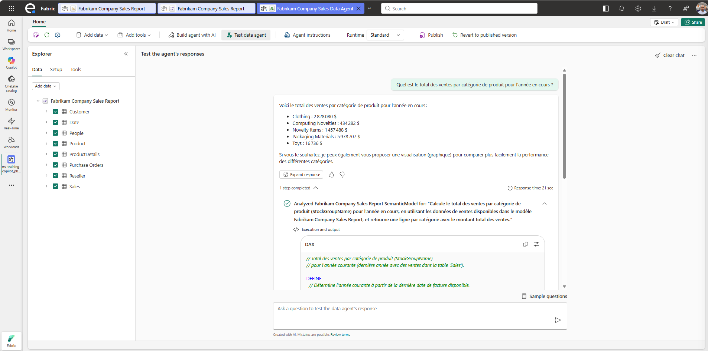
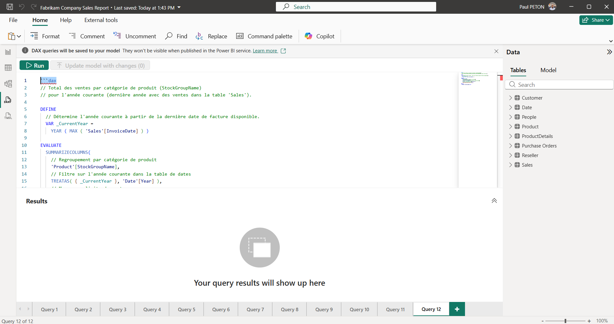
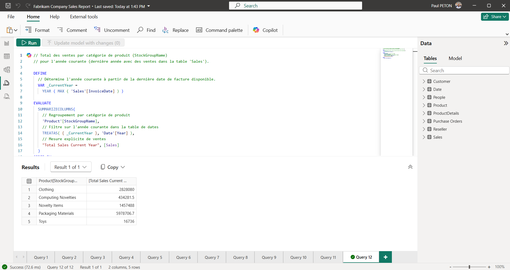

# 2.5. Exécuter la requête DAX générée dans Power BI Desktop (DAX query view)

Ce guide explique comment récupérer la requête **DAX** générée automatiquement par le Data Agent en réponse à une question, puis l'exécuter et l'analyser dans **Power BI Desktop** via la vue **DAX query view**.

## Prérequis

- Le Fabrikam Data Agent est opérationnel et optimisé (voir les étapes [2.1](2.1.%20Cr%C3%A9er%20un%20Data%20Agent%20sur%20un%20mod%C3%A8le%20s%C3%A9mantique.md) à [2.4](2.4.%20Optimiser%20les%20instructions%20pour%20bien%20r%C3%A9pondre%20sur%20des%20questions%20de%20contexte%20m%C3%A9tier.md)).
- **Power BI Desktop** (version récente, prenant en charge la DAX query view) est installé sur le poste.
- Vous disposez d'un accès au modèle sémantique **Fabrikam Company Sales Report** (connexion en direct ou copie locale).

## Étapes

### 1. Poser une question au Data Agent

1. Ouvrir le **Fabrikam Data Agent** dans le Workspace [FORMATION].
2. Dans le volet de test (chat), poser une question analytique, par exemple : *"Quel est le total des ventes par catégorie de produit pour l'année en cours ?"*.
3. Attendre la réponse générée par le Data Agent.

### 2. Afficher les détails / la requête générée

1. Sous la réponse, repérer un lien ou une icône du type **Voir les détails**, **Afficher la requête** ou **Explication** (l'intitulé exact peut varier selon la version).
2. Cliquer dessus pour dérouler le panneau de détails.
3. Le Data Agent affiche la requête **DAX** qu'il a générée et exécutée en arrière-plan pour produire la réponse.

> 

### 3. Copier la requête DAX

1. Sélectionner l'intégralité du texte de la requête DAX affichée.
2. Utiliser le bouton **Copier** s'il est proposé, ou copier manuellement (`Ctrl+C`).

### 4. Ouvrir Power BI Desktop et se connecter au modèle

1. Lancer **Power BI Desktop**.
2. Cliquer sur **Fichier > Obtenir les données** (ou **Accueil > Power BI semantic models**).
3. Sélectionner le modèle sémantique **Fabrikam Company Sales Report** dans le Workspace [FORMATION].
4. Se connecter en mode **Direct Lake/Live connection** au modèle.

> 

### 5. Ouvrir la vue "DAX query view"

1. Dans le bandeau de gauche de Power BI Desktop, cliquer sur l'icône **DAX query view** (icône représentant une requête, à côté des vues Rapport/Données/Modèle).
2. Un éditeur de requête DAX s'ouvre, vide par défaut.

### 6. Coller et exécuter la requête DAX

1. Coller la requête DAX copiée à l'étape 3 dans l'éditeur (`Ctrl+V`).
2. Cliquer sur le bouton **Exécuter** (ou utiliser le raccourci `Ctrl+Entrée`).
3. Le résultat s'affiche sous forme de tableau dans le volet inférieur.

> 

### 7. Comparer le résultat avec la réponse du Data Agent

1. Comparer les valeurs obtenues dans Power BI Desktop avec la réponse initialement donnée par le Data Agent.
2. Vérifier la cohérence des chiffres (mêmes totaux, mêmes catégories).

## Résultat attendu

- Les stagiaires savent retrouver la requête DAX générée par le Data Agent, l'exécuter dans Power BI Desktop via la DAX query view, et valider la cohérence des résultats.

---

Fin du lab **Data Agent**.
